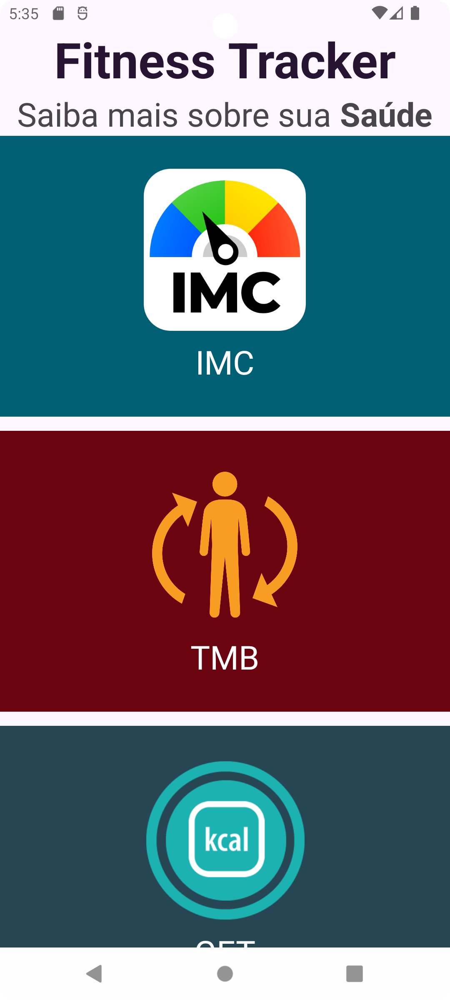
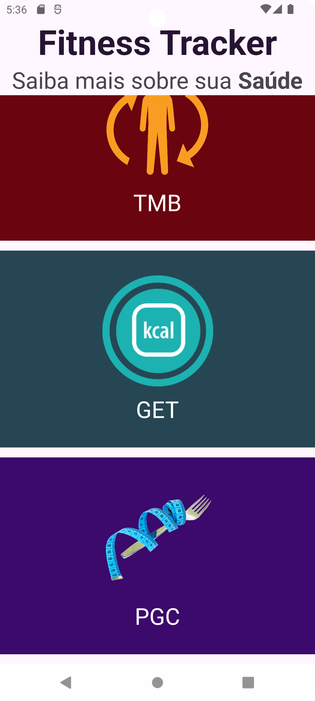
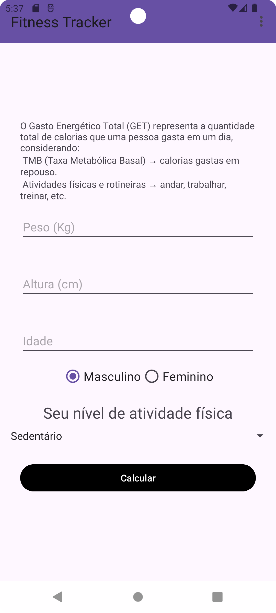
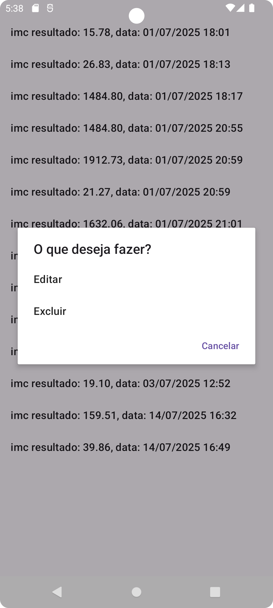

# 📱 Fitness Tracker

Um aplicativo Android simples e didático para calcular e registrar diferentes métricas corporais: **IMC**, **TMB**, **GET** e **%Gordura Corporal**.

---

## 🎯 Funcionalidades

- ✅ Cálculo de **IMC**, **TMB**, **GET** e **PGC**
- ✅ Salvamento automático dos resultados no banco de dados local
- ✅ Exibição dos resultados em uma lista por categoria
- ✅ Edição ou exclusão de registros via clique longo
- ✅ Interface simples e responsiva
- ✅ Menu superior para busca de resultados

---

## 📸 Tela Principal

A tela principal apresenta botões com ícones e cores distintas para cada cálculo.

---

## 🧮 Cálculos Suportados

- **IMC**: Índice de Massa Corporal
- **TMB**: Taxa Metabólica Basal
- **GET**: Gasto Energético Total
- **PGC**: Percentual de Gordura Corporal

---

## 💾 Banco de Dados

Utiliza **Room** como ORM para persistência local.
Todos os resultados calculados podem ser editados ou excluídos.

---

## 🔄 Fluxo de Edição

1. Usuário faz um **clique longo** em um item da lista.
2. É exibido um diálogo com as opções: `Editar` ou `Excluir`.
3. A opção `Editar` leva de volta à tela de cálculo, preenchendo os dados com base no ID.
4. Ao recalcular, o valor anterior é sobrescrito no banco.

---

## 📂 Estrutura de Pacotes

```
├── activities/           # Telas principais da aplicação (IMC, TMB, GET, etc.)
│   ├── GetActivity.kt
│   ├── ImcActivity.kt
│   ├── ListCalcActivity.kt
│   ├── MainActivity.kt
│   ├── PgcActivity.kt
│   └── TmbActivity.kt
│
├── model/                # Estruturas de dados e camada de persistência
│   ├── App.kt
│   ├── AppDatabase.kt
│   ├── Calc.kt
│   ├── CalcDao.kt
│   ├── DateConverter.kt
│   └── Gender.kt
│
├── utils/                # Utilitários diversos da aplicação
│   ├── calculators/      # Cálculos e avaliações de saúde
│   │   ├── Calculator.kt
│   │   ├── HealthEvaluator.kt
│   │   └── PhysicalActivityLevel.kt
│   │
│   ├── helpers/          # Auxiliares de navegação, diálogos e armazenamento
│   │   ├── DialogHelper.kt
│   │   ├── NavigationHelper.kt
│   │   └── SaveHelper.kt
│   │
│   ├── ui/               # Componentes de interface reutilizáveis
│   │   ├── MainItem.kt
│   │   └── OnItemClickListener.kt
│   │
│   └── validators/       # Validações de input do usuário
│       └── InputValidator.kt
```

---

## 🧠 Padrões de Projeto Utilizados

- **MVC (Model-View-Controller)**  
  Separação entre as *Activities* (View), lógica de cálculo e validação (Controller), e camada de dados com Room (Model).

- **Singleton Pattern**  
  Utilizado nas classes `App`, `SaveHelper`, `DialogHelper` e `NavigationHelper`, garantindo instâncias únicas acessíveis globalmente, além da criação da instância única do banco de dados (`AppDatabase`).

- **Strategy Pattern** *(implementação parcial)*  
  Aplicado indiretamente nas funções de cálculo em `Calculator.kt`, onde cada cálculo (IMC, TMB, GET etc.) é tratado de forma intercambiável conforme o contexto. Também presente em `HealthEvaluator.kt`.

- **Adapter Pattern**  
  Usado nos adaptadores de lista para exibição dos registros salvos, seguindo o padrão de separação entre dados e apresentação.

- **Repository Pattern** *(implícito)*  
  A estrutura `CalcDao` e sua integração com o `AppDatabase` centralizam o acesso aos dados, separando a lógica de persistência do restante da aplicação.

- **Helper / Utility Classes**  
  Classes utilitárias como:
  - `DialogHelper`: cria diálogos reutilizáveis;
  - `NavigationHelper`: encapsula a navegação entre telas;
  - `SaveHelper`: gerencia a lógica de salvamento no banco e redirecionamento;
  - `InputValidator`: valida campos antes de cálculos ou persistência.

Esses padrões foram adotados para promover **organização**, **reuso de código** e **separação de responsabilidades**, facilitando a manutenção e expansão futura do projeto.

---

## 🖼️ Screenshots

<p align="center">
  
  
</p>

<p align="center">
  
  
</p>


## 🛠️ Tecnologias Utilizadas

- Kotlin
- Android SDK
- Room (Jetpack)
- RecyclerView
- Material Design
- XML Layouts
- SQLite
- Threads e Handlers
- Context e Intents

---

## 🧑‍💻 Autor

**Tiago Marcial**

> Projeto desenvolvido para fins de estudo e prática com Android.  
> Feedbacks e sugestões são bem-vindos!

[🔗 LinkedIn](https://linkedin.com/in/tiago-marcial)  
[📧 Email](mailto:tiago.127@gmail.com)  
